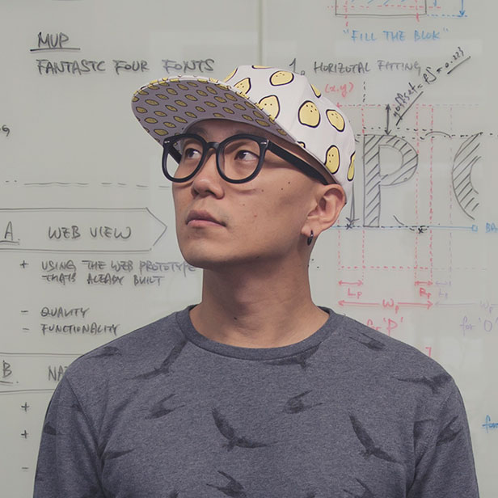

# Learnings from working on early stage humanoids - human robot interaction

In late September we were asked to work with humanoids,
to define early best-in-class UX/UI principles,
and to transform complex systems into intuitive experiences; very broad if you ask me.

## Natural skeptics as we are

We had our prejudices, so naturally we asked: **Why humanoids though?**

Not that humanoids were not popping up left and right but after a lot of digging and back and forth, we realized that, leading tech giants and venture funds are betting big on key humanoid startups. We understood early that probably the robotics industry is here to stay and grow.  

1. It is one of the natural next steps to drive innovation and to create new application levels, combining all individual technological pillars, we have seen so far- as robotics combines everything.
2. But to do so, it requires investment. Thus the companies need to show they can scale up and have a clear purpose to attract major backers.
3. And so, finally, humanoids are gaining traction because they fit right into our existing world - from offices to factories - with minimal changes needed. Or, at least that’s how we are currently thinking. At-least, that’s what everyone thinks. 

 

> *Cars, drones, and humanoid robots can scale to high volumes since
> they work in our existing infrastructure and the highest volume one is
> humanoid robots, of course, because we created the world for ourselves.*
>
> Jen-Hsun "Jensen" Huang (CEO - NVIDIA)

For a moment we thought, isn’t it same like autonomous driving,
that we were trying to solve the mixed traffic problem, to make them fit in our world,
and yet here we are still struggling. And, to be honest, we had to redesign roads.

> Hold that thought for a moment.

</aside>

## Challenge accepted

We thought “why not” and so jumped in.

### Our research → Our Insights

Explored interaction expectations, use-case scenarios, and took into account academic perspectives to inform our design decisions. By analyzing industry' focus areas and identifying gaps in user experience within the humanoid context, we established some foundations for meaningful human-robot interactions and future steps.

We found that currently:

1. Companies prioritize features over purpose, as finding real-world use cases and market fit remains challenging for these new product categories.
2. Basic robotics challenges remain unsolved, with varying progress across companies. Most focus on core capabilities before adding advanced features.
3. Design approaches differ between human-like robots and task-specific machines, with adoption depending on use case.
4. Key concerns include job displacement, ethical considerations, and data privacy. Academic discussions are ongoing, but frameworks for human-robot interaction remain undefined.

Talking about perception …

> *It’s time to get away from one dimensional understanding of ‘uncanny valley’. Key considerations include safety, multi-modality, role adaptability, and intelligence.*

Siniz Kim - Partner and Co-Founder zigzag.is

The uncanny valley goes beyond just reactions to human-like appearance -
it involves behavior, context, and emotional factors working together.
Rather than responding to isolated features, people react to the complete experience.
Building familiarity over time helps overcome initial discomfort.

---

Florian Dusch - Partner and Co-Founder zigzag.is

> *Although many affordances depend on the humanoid's specific role, we ultimately developed key design principles for humanoid interactions, role agnostic:*

1. Human acceptance is paramount
2. Actions should be transparent & traceable
3. Behavior should be predictable & consistent
4. Interactions should be elegantly personalized
5. Ethical integrity should be at the very core
6. Privacy should be respected and safeguarded

---

Our Principles has helped us with decision-making by aiding to align across multiple disciplines and stakeholders involved and acted as a barometer, enabling scalability, and preserving insights that would future-proof the efforts.

During tenuous hours and weeks for concept development and prototyping human robot interactions (to some what influence our design decisions), we concluded that there are so many interesting design challenges that need to be solved but acting on these individual challenges need some thinking and isolating them is hard.

One recurring observation is that many elements come into play: sound effects, motion, size, shapes, lights, and new smart materials—all orchestrated by intelligence.

*Beyond making robots work and achieve human-like dexterity, we believe there needs to be an effective authoring tool to design and prototype these interactions and experiences.*

Such a tool could also serve as a [digital twin](https://blogs.nvidia.com/blog/what-is-a-digital-twin/), allowing us to quickly prototype interactions and transfer them directly to the humanoid.

There exists a plathora of industrial path planning softwares, some for specific brands for their robots and others are brand agnostic

Several companies are developing simulation software, including a promising collaboration between Siemens and Unity (Game Engine). Nvidia has also created their own simulation environment.

However, we rarely see a comprehensive authoring tool in the wild that allows designers, animators, and engineers to collaboratively create, test, visualize, and export humanoid behaviors and characteristics. 

What are your thoughts?  Our explorations gave us a peek into numerous exciting opportunities that we could explore together — always considering your business needs and staying grounded in realistic possibilities.
