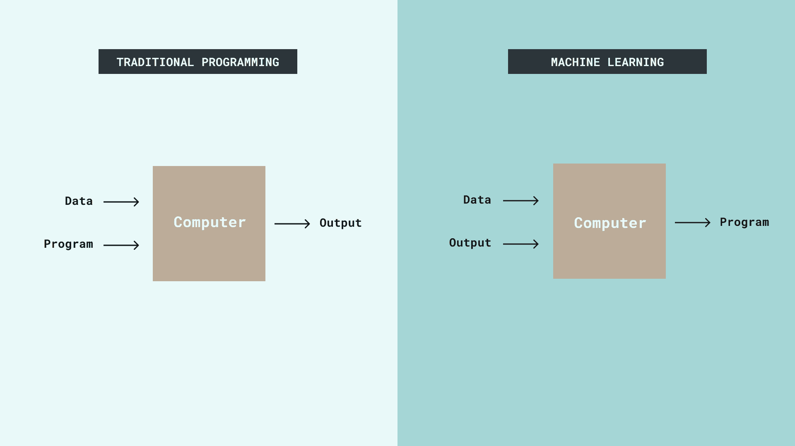
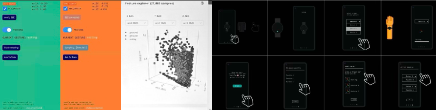
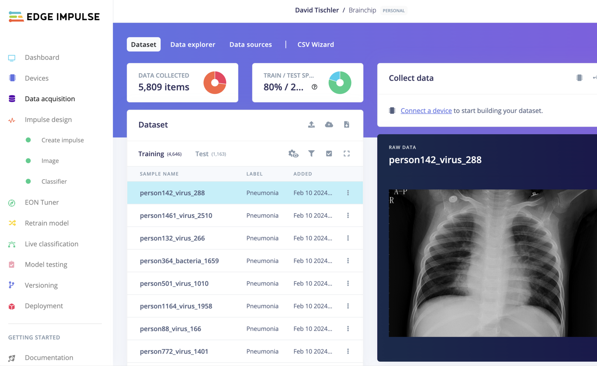

# Beyond LLMs: Bridging the gap Between Machine Learning and the Physical World

<!--  -->

## While LLMs dominate headlines, they aren't well-suited for embedding intelligence in everyday devices. So where else should we look, and what alternatives can we explore?

> TinyML (Tiny Machine Learning) offers a promising path for embedding efficient intelligence in consumer electronics without the need for massive server farms and data centers to operate and can be  resilient to connectivity loss. Through smaller quantized models, we can develop targeted solutions for both new and existing products. Here we explore this technology's current capabilities, its implications for design, and the business value it delivers.
>

---

## But first, let’s face it … (stating the obvious)

We know AI explorations gained popularity and acceptability because of transformers and LLMs and because of the natural language-based interface. But they were made possible because of the technologies that came before that—yes, the internet, alongside cheap server farms, massive storage, etc.—all leading to connectivity and data sharing, making it possible to source and curate information, train and deploy models, and make them accessible via API, so when you call that OpenAI API, you get a response almost instantly.

At its core, it's text-based—and there's nothing inherently wrong with that. After all, computers convert everything into numbers anyway, whether it's text or images.

<!--  -->

## We like intelligence but are we implementing it correctly?

The stated approach works well for many current use cases. We're even seeing sectors like IoT being rebranded as AIIoT (AI + IoT), as the combination of connectivity and intelligence offers natural advantages. The typical scenarios involve sending data packets wirelessly to servers where they're analyzed and "understood" to determine the next actions. With fast network bandwidth, these processes happen seamlessly.

But where's the catch?

<!--  -->

1. **💸 Cost:** Every ping and response comes with a monetary cost in the form of token usage.
    > As I write this article and use AI services to correct my grammar, I pay a cost

    <!--  -->
    

    Companies are testing different ways to make money from AI, both for businesses and regular users. For example, Amazon recently invested $5 billion in Anthropic (as of Nov 2024). This makes sense because Anthropic uses Amazon's cloud services (AWS), and Amazon makes its own computer chips. But here's something interesting: Anthropic recently raised prices for regular users of their newest AI model, Claude Sonnet. This price increase is unusual compared to how most companies conduct business.

    On the other hand, for product companies, the intelligent processors in devices need to be cost-effective for manufacturing and scalability. While running pre-trained models doesn't require massive computing power, even my latest M4 MacBook Pro still takes time to run 70 Bn parameter models locally (as of Nov 2024). That's why probably we won't see state-of-the-art Nvidia GPUs in smart sinks or coffee machines anytime soon—even the [Nvidia Jetson](https://developer.nvidia.com/buy-jetson) or [PI AI HAT](https://www.raspberrypi.com/products/ai-hat/) are probably overkill for these applications.

2. **⚡️ Energy:** Then there's the matter of energy usage. Not a lot, but still something to consider if we are aiming for building future-proof infrastructures.

    <!--  -->
    

    > [Data centres use around 1 to 2% of the world’s electricity. When cryptocurrency is included, it’s around 2%.](https://www.sustainabilitybynumbers.com/p/ai-energy-demand)

3. **Unforeseen circumstances:** Say you're on a ship in the middle of the ocean and aren't subscribed to Starlink …

    <!--  -->
    

    What about internet blackouts (say you're in an autonomous car somewhere with little to no internet), or not having internet at all? Even better, what if you're a hospital and probably don't want any data even on "on-premise" servers (for obvious security and privacy reasons)?

---

### Stepping back I wonder: *Are we using sledgehammers to crack nuts?*

<!--  -->

All these models that everyday folks like me use are **general purpose models**—trained on vast amounts of data covering everything imaginable.

Currently, for specific use cases, we typically take one of these models and apply RAG to fine-tune it (essentially a last-minute training approach). Some of us then quantize the model to reduce its memory footprint and size, making it run more efficiently.

Could we instead use targeted machine learning approaches rather than AGI to solve specific tasks?

---

### This new kid is not a new kid in the block after all

While companies like [archetypeai](https://www.archetypeai.io/) are taking a sensor fusion approach to understand the physical world, there's something magical about low-key approaches. Tiny Machine Learning has been around for a while, but you may consider the whole movement a bit of an underbelly since it doesn't get as much attention in media as the other fellow.

**So what is it in Layman’s language without going too much into the theory?**

<!--  -->

> 💡
> If regular AI is like sending your kid to an expensive boarding school with unlimited resources, TinyML is like teaching them to be brilliant while living in a tiny house. It's the art of squeezing sophisticated machine learning into devices smaller than your AirPods case, running on less power than it takes to charge your phone. No cloud required, no hefty electricity bills - just lean, mean, learning machines.

### Or

> 💡
> Think of it as when  machine learning goes on a diet to fit into microcontrollers. It's the technology that lets your smartwatch predict heart problems without phoning home to the cloud, and helps your security camera tell the difference between your cat and a burglar using less power than a LED bulb. Think of it as AI's minimalist movement - doing more with less."

Now is the perfect time to revisit this approach, especially since companies like [EdgeImpulse](https://edgeimpulse.com/) have created an excellent one-stop shop for developers working with embedded systems and physical products. While enterprise solutions like AWS Lambda exist for larger applications, let's focus on these simpler yet powerful tools to under what we as designers can do with them.

> Traditional programming vs Machine learning | Source: Arduino Blog

---

### 🛠️ Things we have tried recently

People talk about boring Industry applications, we want to have some fun … As designers and people who craft experiences we like to sketch in physical to understand the affordances and limitations of technologies and tools to be then able to craft better future, products, services and experiences.

### 👋🏻 Motion

Motion input has many potential applications. For example, vibrations can help detect anomalies in industrial equipment, or as mentioned earlier, your smartwatch can analyze motion data to predict abnormal behavior. What if you want to study Raindeer's grazing behavior in Lapland 🦌 ? potentials are endless!

In an example below, we used an off-the-shelf component (Arduino Nano BLE 33 sense) packed with various sensors which comes with a relatively powerful embedded microcontroller. With this, we quickly prototyped a system to collect and classify broad arm gestures, linking different motions to user-definable actions (think of the old "if this, then that" concept).

*The whole inference took less than 15 ms to occur and was running completely onboard without any internet connection.*

 

 

> What else can we do with accelerometer data where low power operation, portability, and responsiveness are essential?
>

---

### 🔈 Audio

You may already know that when you call upon your smart speaker with that wake word ("Hey Google" / "Hey Alexa"), that "wake word" detection happens locally, on a co-processor. That's TinyML in action.
Of course these processors can't do continious Natural Language Processing and that is not the purpose here.

What if that smart home sensor could detect if you've left your faucet running by just listening to ambient sound, and what if you could teach your Roomba correct navigation using simple words?  

In one example, we used an off-the-shelf Arduino Nano BLE 33 sense—a component packed with various sensors, a powerful embedded microcontroller, and a PDM microphone. With this setup, we quickly prototyped a system to collect and classify baby cry audio data 👶 to determine why a baby might be crying. No need to send your baby's cries to OpenAI.

 

> What else can we do with audio data where low power operation, privacy, and responsiveness are essential?

---

### 👀 Vision

Today, many inexpensive microcontrollers like the ESP32 series have sufficient onboard memory and processing power. Meanwhile, popular image processing models like YOLO, MobileNet, and FOMO are becoming highly optimized to run on mobile and low-power devices.

> 💡
> We're currently working on an example to evaluate its potential (both serious and fun), but meanwhile we've found two examples that are both fun and demonstrate what's possible.

[Lego Trigger](https://www.rubenvandervleuten.com/lego-trigger)

 

[X-Ray Classification and Analysis](https://docs.edgeimpulse.com/experts/image-projects/brainchip-akida-xray-classification)

---

... Other sensors and sensor fusion ...

... Interaction Design ...

... Conclusion and cry to connect ...
