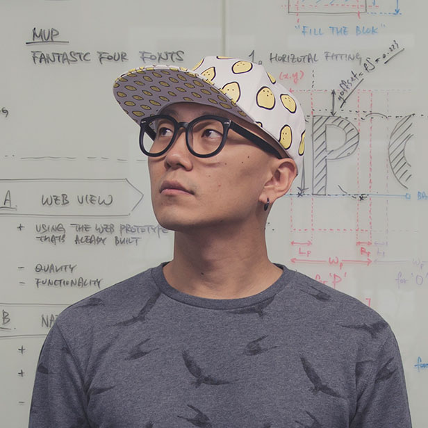

# Learnings from working on early stage humanoids - human robot interaction

## Posting Text / Caption
> In this article, we explore the challenges and opportunities of developing humanoids and the intricacies when designing the interaction with humans. While companies focus on features rather than purpose, certain robotics challenges - especially those related to human dexterity - remain unsolved.
> 
> Ethical considerations, data privacy, and workforce disruptions are key concerns. The integration of humanoids is reshaping industries, raising questions not only about their physical appearance but also about their impact on jobs and employment dynamics.
>
> Despite these challenges, we are witnessing one of the most transformative shifts in decades - paving the way for groundbreaking innovations in robotics, human-machine collaboration, and industry evolution. The future holds immense potential. 

We had our prejudices, so naturally we asked: Why humanoids though? Not that humanoids were not popping up left and right but after a lot of digging and back and forth, we realized that leading tech giants and venture funds are betting big on key humanoid startups. We understood early that probably the robotics industry is here to stay and grow.

1. It is one of the natural next steps to drive innovation and to create new application levels, combining all individual technological pillars, we have seen so far - as robotics combines everything.
2. But to do so, it requires investment. Thus the companies need to show they can scale up and have a clear purpose to attract major backers.
3. And so, finally, humanoids are gaining traction because they fit right into our existing world - from offices to factories - with minimal changes needed. Or at least, that’s the assumption we’re making for now.

 

> “Cars, drones, and humanoid robots can scale to high volumes since they work in our existing infrastructure. The highest volume one, of course, is humanoid robots, because we created the world for ourselves.”
> 
> — Jen-Hsun "Jensen" Huang (CEO of NVIDIA) at the DealBook Summit in November 2023.

For a moment, we thought: Isn't this the same as autonomous driving? We tried to solve the mixed-traffic problem, making them fit into our world - yet here we are, still struggling.

We see humanoids as the physical manifestation of AI—or as the term was coined, "embodied AI". The challenges are vast but the opportunities and new use cases are also enormous.  

</aside>

## Challenge accepted

What an incredible chance we had to help shape how humans will interact with humanoid robots! Our whole team was buzzing with enthusiasm as we jumped into this exciting journey.

### Our Research and Our Insights - The Early Days

We explored interaction expectations, use-case scenarios, and took into account academic perspectives to inform our design decisions. By analyzing industry's focus areas and identifying gaps in user experience within the humanoid context, we established some foundations for meaningful human-robot interactions and future steps.

We found that currently:

1. Companies prioritize features over purpose, as finding real-world use cases and market fit remains challenging for these new product categories.
2. Some robotics challenges remain unsolved or are in development (mostly human dexterity related), with varying progress across companies. Most focus on core capabilities before adding advanced features.
3. Design approaches differ between human-like robots and task-specific machines, with adoption depending on use case.
4. Key concerns include job displacement, ethical considerations, and data privacy. Academic discussions are ongoing, but frameworks for human-robot interaction remain undefined.

Talking about perception …

> *It’s time to get away from one dimensional understanding of ‘uncanny valley’. Key considerations include safety, multi-modality, role adaptability, and intelligence.*

Siniz Kim - Partner and Co-Founder zigzag.is

The uncanny valley goes beyond just reactions to human-like appearance -
it involves behavior, context, and emotional factors working together.
Rather than responding to isolated features, people react to the complete experience.
Building familiarity over time helps overcome initial discomfort.

---

Florian Dusch - Partner and Co-Founder zigzag.is

> *Although many affordances depend on the humanoid's specific role, we ultimately developed key design principles for humanoid interactions, role agnostic:*

1. Human acceptance is paramount
2. Actions should be transparent & traceable
3. Behavior should be predictable & consistent
4. Interactions should be elegantly personalized
5. Ethical integrity should be at the very core
6. Privacy should be respected and safeguarded

---

Our Principles has helped us with decision-making by aiding to align across multiple disciplines and stakeholders involved and acted as a barometer, enabling scalability, and preserving insights that would future-proof the efforts.

During tenuous hours and weeks for concept development and prototyping human robot interactions (to some what influence our design decisions), we concluded that there are so many interesting design challenges that need to be solved but acting on these individual challenges need some thinking and isolating them is hard.

One recurring observation is that many elements come into play: sound effects, motion, size, shapes, lights, and new smart materials—all orchestrated by intelligence.

*Beyond making robots work and achieve human-like dexterity, we believe there need to be effective ways to understand and design these interactions and experiences in the real world and beyond academia.*

### We would like to learn and join the journey

What are your thoughts on this? Our explorations have revealed numerous exciting opportunities we could pursue together—always keeping your business needs in mind and staying grounded in realistic possibilities. If there's interest, we'll share our initial high-level learnings in upcoming posts.
