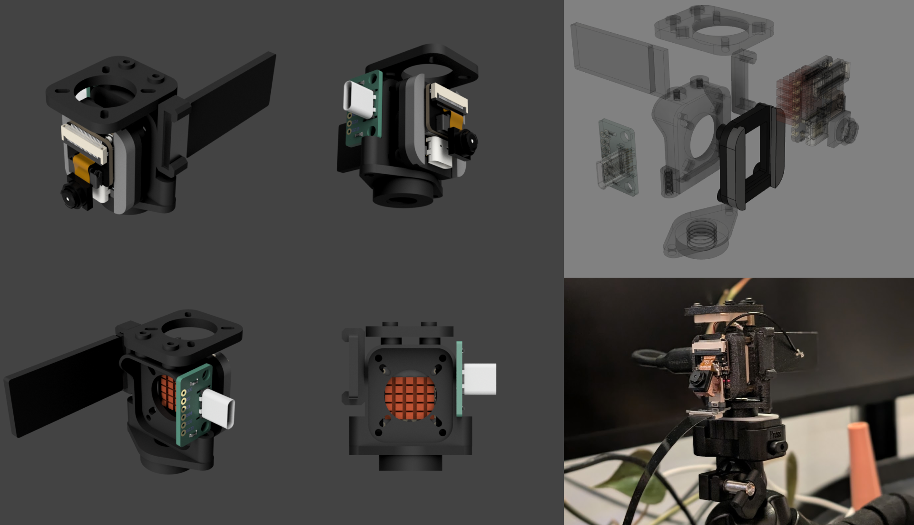
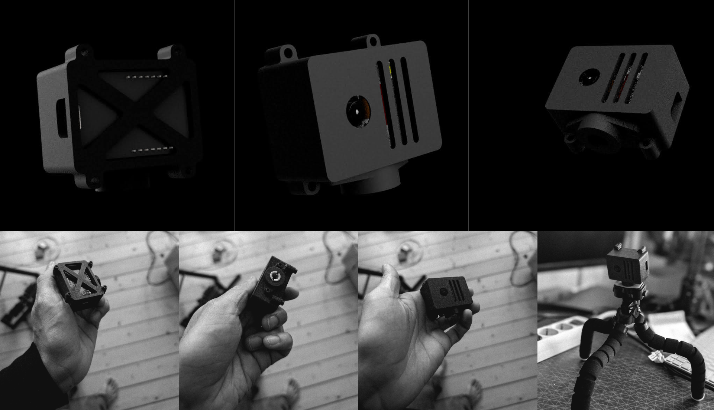
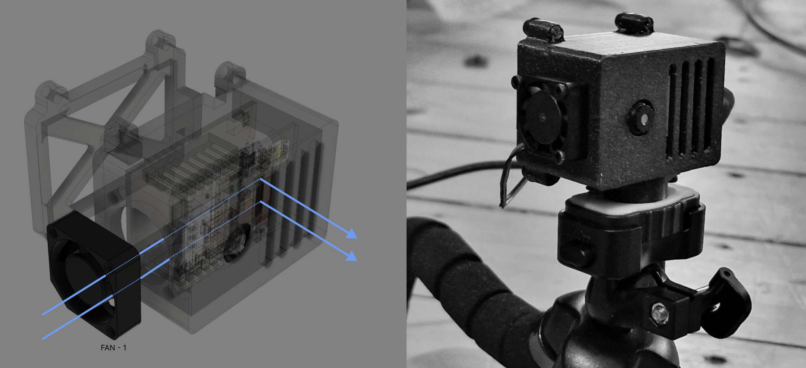
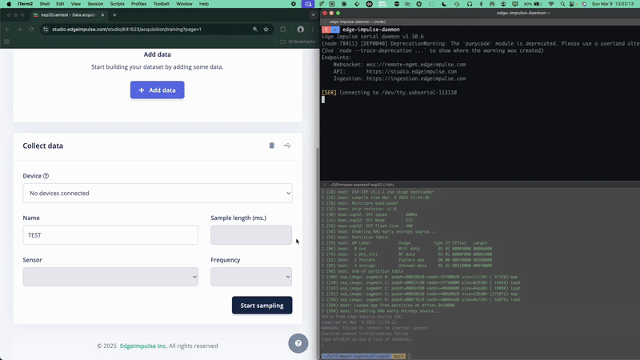
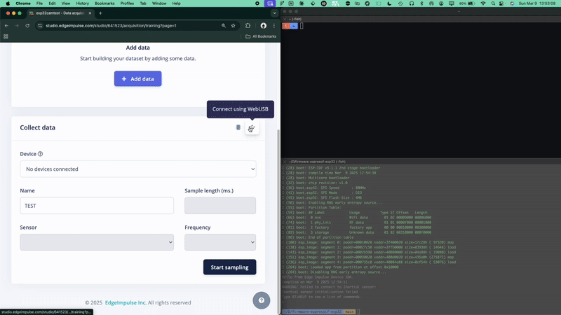
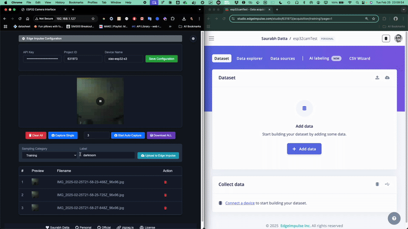
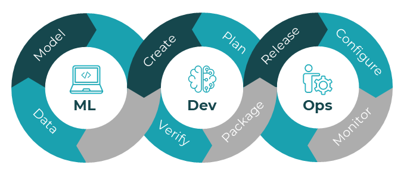

# Beyond LLMs: Bridging the Gap Between Machine Learning and the Physical World - Part III - Simplifying Edge AI Development with ESP32-CAM 🚀

> 👆🏼 header image

In our previous articles ([Part 1](https://www.linkedin.com/pulse/beyond-llms-bridging-gap-between-machine-learning-physical-p2mde/?trackingId=sKysxhm8DnCIcDfVqIgpPw%3D%3D) and [Part 2](https://www.linkedin.com/pulse/beyond-llms-bridging-gap-between-machine-learning-physical-cwaee/?trackingId=PA2T31JRKSmbr3Gov2Z2Ag%3D%3D)), we explored the exciting frontier where machine learning meets the physical world through edge devices. Today, I'm thrilled to share our prototype demo that simplifies the preparation and pre-training process for Edge Impulse projects.

## Vision First, Expansion Later 👁️

Our current proof-of-concept and tool implementation will focus on vision-based TinyML. Future updates will include support for audio data, accelerometer readings, and other sensor fusion applications - creating a comprehensive edge AI development platform.

> Xiao with custom mount and colling contraption

 
 

> AI Thinker Cam with custom mount and colling contraption

## The Challenge: Data Collection for Edge AI ⚠️

One of the biggest hurdles in deploying machine learning models on edge devices is efficient data collection. Before you can train a powerful model, you need quality data - and lots of it. This process can be tedious, especially when working with visual data from micro-controllers.

Many brilliant engineers and developers find themselves stuck in this preparation phase, spending countless hours manually capturing and organizing training data rather than focusing on model architecture and application development.

### The Power of Edge Impulse 🔧

Having leveraged [Edge Impulse](https://edgeimpulse.com/) extensively in the past—primarily for audio processing and sensor data projects—I can confidently say this platform revolutionizes TinyML development.

[Edge Impulse](https://edgeimpulse.com/) elegantly streamlines the entire machine learning workflow for both beginners and industrial applications. By integrating core technologies like TensorFlow Lite while providing an intuitive interface for data collection, training, and deployment across diverse micro-controllers, it removes significant barriers to entry.

What truly sets [Edge Impulse](https://edgeimpulse.com/) apart is its comprehensive [API stack](https://docs.edgeimpulse.com/reference) and [remote management protocol](https://docs.edgeimpulse.com/reference/remote-management/remote-management-websocket), which we'll be utilizing as the foundation for our solution.

This powerful combination of accessibility and capability makes it the perfect platform for our edge AI implementation journey.

But some data collection is not so straight forward ...

> edge-impulse-daemon (post flashing the exported binary and locally compiling and flashing) with Official ESP-EYE has some issues to be just yet beginner friendly

 

> The data collection through webserial process, from the studio works, but stream over serial is of course very slow and moreover sitting there taking images one by one would take a lot of time.

## Introducing Our Solution: ESP32-CAM Server 💡

We've developed a streamlined tool that makes camera data collection for Edge Impulse projects remarkably simple. Our solution leverages the affordable ESP32-CAM (xiao esp32-s3) module to create a powerful data collection server.

### Why ESP32-CAM though?

While various camera options exist in the edge AI ecosystem - including [SIPEED modules](https://sipeed.com/solution), [Arduino Nicla Vision](https://docs.arduino.cc/hardware/nicla-vision), [industrial-grade Protenta](https://www.arduino.cc/pro/hardware-product-portenta-vision-shield/), and [OpenMV cameras](https://openmv.io/?srsltid=AfmBOoosgB-C9MItnlP3IU2b9ZFk1MMIADtriZtira1mYrOw5Ea5YgUw), [ESP-EYE](https://www.espressif.com/en/products/devkits/esp-eye/overview), [esp32 AI Thinker CAM](https://www.berrybase.de/esp32-cam-development-board-inkl.-ov2640-kameramodul) amnd many more - we chose the [Seeed Studio's XIAO ESP32S3](https://wiki.seeedstudio.com/xiao_esp32s3_getting_started/) for several compelling reasons:

1. **Affordability**: It's one of the most cost-effective options for features and performance for computer vision projects
2. **Accessibility**: Widely available and supported by a large community
3. **Capability**: Despite its small size and low cost, it offers a surprisingly capable 2MP OV2640 camera
4. **Versatility**: The ESP32 micro-controller provides Wi-Fi connectivity, making it ideal for our server approach

> Currently Our data collection firmware supports 3 popular esp32 based camera boards

### How Our Tool Works ⚙️

Our ESP32-CAM Server was born from a real frustration: the tedious process of capturing, organizing, and labeling hundreds of images for edge AI training. After spending countless hours manually photographing objects, transferring images, and structuring datasets for an Edge Impulse project, I knew there had to be a better way.

The tool transforms this cumbersome process through an intuitive web interface:

1. **Instant Deployment**: Flash the provided firmware to your ESP32-CAM module
2. **Connect**: Access the web server via any browser on your local network and configure from the web UI
3. **Capture**: Use the one-click interface to capture images with automatic labeling
4. **Organize**: Images are instantly sorted into appropriate training/testing directories
5. **Export**: Package your dataset with a single click for direct import into Edge Impulse

## Real-World Impact 🌍

This tool addresses critical gaps in the edge AI development workflow:

- **Eliminates Manual Work**: No more SD card juggling, USB connections, or tedious file management
- **Accelerates Development**: Reduce dataset preparation from days to minutes
- **Improves Data Quality**: Automated labeling reduces human error while enabling larger, more diverse datasets
- **Enhances the Experience**: Real-time visual feedback lets you see your dataset grow as you capture
- **Democratizes Edge AI**: Lower technical barriers bring intelligent vision systems to more developers and applications
- **Works Anywhere**: No cloud dependencies or internet connection required after initial setup

By addressing these pain points, we're enabling developers to focus on what truly matters: creating and refining innovative edge AI solutions that solve real-world problems across industries.

> WiFi configuration panel after flashing

## Getting Started 🚦

The entire project is open-source and available on [GitHub](https://github.com/dattazigzag/EI_ESP32_CAM_SERVER). The repository includes:

- Complete source code for the ESP32-CAM server
- Latest compiled firmware with a webflasher 
- Step-by-step setup instructions on various gotchas
- Troubleshooting guides for common issues

### Our Current Focus: ML Ops - The DevOps of Machine Learning 🔄

We're currently focused on ML Ops—think of it as DevOps specifically designed for machine learning projects. Just as DevOps streamlined software development, ML Ops brings that same efficiency to AI development by automating and optimizing the entire machine learning lifecycle. Whether you're a developer, business leader, or just AI-curious, ML Ops is the critical infrastructure that turns promising AI models into reliable, production-ready systems that deliver real value.

src: [docs.edgeimpulse.com/docs/concepts/edge-ai-fundamentals/what-is-edge-mlops](https://docs.edgeimpulse.com/docs/concepts/edge-ai-fundamentals/what-is-edge-mlops)

## What's Next? 🔮

In the next article of this series, I'll demonstrate the full workflow from data collection to deployment. We'll train a custom computer vision model using the data collected with our ESP32-CAM Server, optimize it for edge deployment, and flash it back to the same ESP32-CAM device - transforming it from a data collection tool into a standalone intelligent vision system.

We'll explore how this complete edge AI development cycle can be applied to real-world problems in manufacturing, agriculture, healthcare, and smart infrastructure - creating solutions that operate where the physical and digital worlds intersect.

---

Have you experimented with edge AI deployment? What challenges have you faced in the development process? I'd love to hear your experiences and thoughts in the comments below.

#EdgeAI #MachineLearning #IoT #ComputerVision #ESP32 #EdgeImpulse #EmbeddedSystems #AIEngineering
