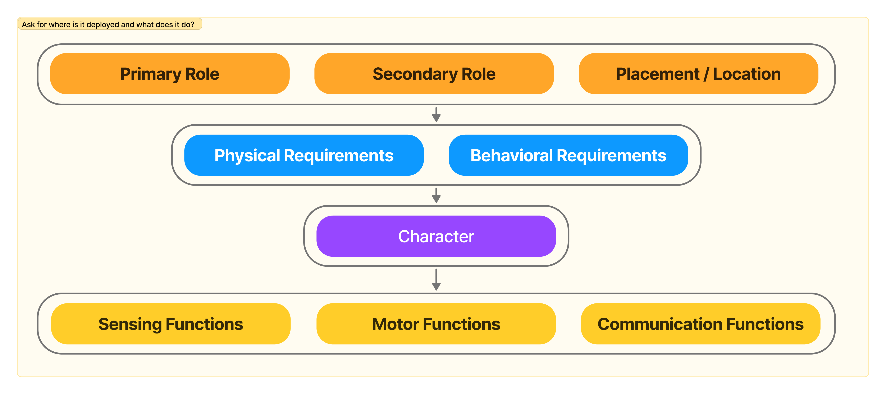

# Humanoids: Why & How to start designing interactions in the early development

While LinkedIn and the news media are flooded with companies developing humanoids to bring them to a level of human dexterity—and sometimes developing features beyond human dexterity ("more-than-human"/"super-human" capabilities)—their highlights mostly revolve around features and numbers, as funding needs to continue coming in to maintain and continue development.

Beyond the widespread fear of humanoids replacing factory workers—and now the anxiety about losing other mundane jobs that few people want anyway—we need to consider how we'll interact with them in the real world when they arrive (_TBD published link_: please have a read of our high level principles from previous article).

As discussed in the previous article, this focus on features and numbers is understandable and justified. However, as humanoids eventually move from factories into our shared spaces (before entering our private homes), we need to start focusing on designing interactions for a future that includes them.

Good news! We can learn from existing robotics products, services, and off-the-shelf technologies. While some of them may not be humanoids, they can inspire us in designing purposeful human-humanoid interactions.

Not so good news: The topic of humanoids, like autonomous driving, has a mixed reputation.

## Lets’ open that can of worms, starting with first the broad level challenges that exists

1. __Fear; A purely technical approach to solve this will fail__: [A great article on HBR: what-a-hitchhiking-robot-can-teach-us-about-automated-coworkers](https://www.notion.so/179a11418df980a0a117d89ba5cabc3e) discusses research that reveals humans' raw nature and extreme reactions when confronting the unknown. Yet one key insight stands out: _Exposure builds trust_

    > This principle could be vital in shared spaces—as humans and humanoids interact more frequently, our instinctive fear of the unfamiliar may diminish.

2. __Acceptance - thus indirectly and partly “Look and Feel” is not enough but needs to be right__: Industrial design plays a crucial role in humanoids’ long term development and acceptance. But also, for these robots, other countless small details and functions must work together seamlessly too. Success depends on more than just appearance — complementary sound effects and movements (body language, gaze direction, etc.) must be precisely crafted to work in harmony. The goal should be to improve robot's displayed behavior to that of expected behavior. And, that varies based on its purpose and context (more on that later).

   > We're trying to move past the stuck-up discussions of the uncanny valley criticism. We agree nobody needs that, but if someone has the resources to create perfect human replicas as humanoids, we can't stop them.

3. __In real world, human beings are unpredictable and we expect a lot:__ Humanoids and their technological capabilities must thus handle edge cases and respond appropriately when facing unexpected challenges. This is crucial because people expect humanoids to be sophisticated machines—not just boxes with computers and sensors.

    > Our sensors and technology stack strategies are binary and cannot provide sufficiently contextual data—at least not at the speed at which human brains compute—to make contextually aware decisions for navigating the impossibly large number of scenarios that need to be considered.

    _A short-term, behavior design solution could be "Raise Exception" (aka call for help to a human agent) when the humanoid faces a challenge, rather than looping mechanical answers as dead ends—very much like you would expect from Amazon's customer service._

---

## And, how might we tackle them through design?

### How to decide on what should they look like and what should they do - a framework to think in

When humanoids move beyond factories (controlled environments) and begin operating autonomously within infrastructure, even in semi-public locations (semi-controlled environments), complexity increases dramatically.

These challenges fall into two categories: technical issues that engineers are working to solve, and complex interaction design problems that need addressing.

__Some key questions we ask ourselves:__

1. How does the robot learn over time - as we do, as humans and should they grow into “characters”? Are we considering these in the ML approaches deployed in these machine and where would be humans in the loop?
2. If a human like learning approach is deployed, can it be misused (_dark code_)? We are talking about __behavioral hacking__: as you know we can teach human babies to learn wrong things :).

    

3. How does the robot communicate and display its current operational states and interaction status?
4. Which non-human elements of appearance, feel, and communication style would be both acceptable and preferable?
5. Can the whole design approach of hardware and software be modular?

An, there are many more, but let’s focus on the last 3 points for now and TBC ...